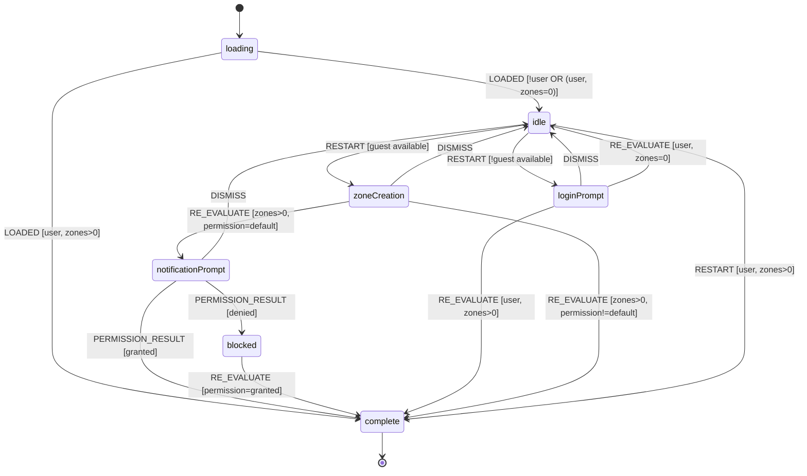

# Onboarding Flow

State machine hook for managing the user onboarding and engagement flow.

## Overview

This hook centralizes the onboarding UX logic using contextual prompts instead of cold-path modals:

1. Zone creation (on explicit user action only)
2. Notification permission (contextual, after zone saved)
3. Guest usage (anonymous Firebase account)
4. Optional Google login upgrade

**Design principle:** "Value before ask" — users explore events freely on first visit.
No blocking modals on initial load. Zone creation and notification prompts only appear
after explicit user action.

## Anonymous-first behavior

- The app creates a Firebase anonymous account on first open.
- Guest users can create zones and enable push notifications on the current device.
- Guest data persists until browser/app data is cleared.
- If anonymous auth is temporarily unavailable, UI surfaces a Google sign-in path instead of guest actions.

## Contextual prompts

- **Geolocation:** Non-blocking toast banner instead of a blocking modal.
- **Notifications:** Prompted only after a zone is saved — peak intent, clear motivation.
- **Login:** Persistent `GuestBanner` at the bottom of the message list for anonymous users. Non-blocking, always visible.

## Guest-to-Google upgrade prompt

When a guest user logs in with Google and **both** guest + account already have data,
the app shows a mandatory conflict prompt:

- Title: **„Как да използваме данните ти?"**
- Body: **„Открихме данни от гост режим и от профила ти. Избери как да продължим."**
- Options:
  - **„Импортирай"** (moves guest data into account)
  - **„Запази отделно"** (no data movement)
  - **„Замени"** (replaces account context with guest context)

No silent merge/overwrite occurs when both sides have data.

The prompt is blocking: users must choose one of the three options to continue.

**All Users (including auto-authenticated anonymous):** Land in `idle` state on first visit.
The UI shows a "Получавай известия" button — the onboarding flow starts only when the
user clicks it (RESTART action). A persistent `GuestBanner` at the bottom of the message
list encourages sign-in for anonymous users.

**Header Login:** Logging in from the header re-evaluates the flow immediately.
If the user was idle and then logs in, they stay in idle (no cold-path modal).

**Logout behavior:** Signing out no longer triggers the browser notification
permission prompt. When permission is not granted, logout skips FCM token cleanup
to avoid requesting permission during sign-out.

**Authenticated Users with zones:** Land directly in `complete`.
No cold-path notification, login, or zone creation modals.

## State Machine Diagram

## States

| State                | Description                                                     | UI Shown                                              |
| -------------------- | --------------------------------------------------------------- | ----------------------------------------------------- |
| `loading`            | Initial state while checking subscriptions                      | LoadingButton ("Зарежда се..." + spinner)             |
| `notificationPrompt` | Ask user about notifications (after zone creation)              | NotificationPrompt                                    |
| `blocked`            | Notifications blocked at browser/OS level                       | BlockedNotificationsPrompt                            |
| `loginPrompt`        | Ask user to log in (only when guest auth unavailable)           | GuestBanner (non-blocking)                            |
| `zoneCreation`       | User clicked button, guided to create first zone                | AddInterestsPrompt                                    |
| `complete`           | Fully onboarded                                                 | AddInterestButton ("Добави зона")                     |
| `idle`               | Initial state for all users, or user dismissed flow             | NotificationButton ("Получавай известия" + bell icon) |

## Actions

| Action              | Description                                | Valid From                                          |
| ------------------- | ------------------------------------------ | --------------------------------------------------- |
| `LOADED`            | Initial load with context                  | `loading`                                           |
| `PERMISSION_RESULT` | Browser permission result                  | `notificationPrompt`                                |
| `DISMISS`           | User dismissed current prompt              | `notificationPrompt`, `loginPrompt`, `zoneCreation` |
| `RESTART`           | Re-enter flow from idle                    | `idle`                                              |
| `RE_EVALUATE`       | External state changed (user, zones, etc.) | All                                                 |

> **Note:** The `blocked` state has no user actions. Users can only exit via `RE_EVALUATE` when they enable notifications in browser settings.
> **Note:** The `notificationPrompt` only appears as a contextual trigger after zone creation — it never appears on cold load.
