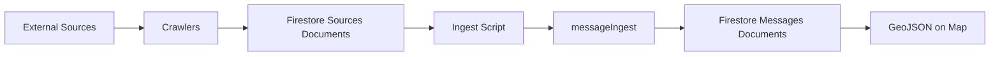

# Crawlers

Automated data collectors that fetch public notifications and disruptions from external sources, storing them as raw documents in Firestore.

## How They Work

Each crawler:

1. Fetches raw data from its source (web scraping or API)
2. Extracts structured information (title, content, dates, URLs)
3. Stores documents in Firestore with `sourceType` identifier
4. Tracks processed URLs to avoid duplicates

## Pre-refactor contract tests

The baseline for [#579](https://github.com/oboapp/oboapp/issues/579) protects current behavior before the independently packaged sources migration in [#586](https://github.com/oboapp/oboapp/issues/586). Run from the repository root:

```sh
pnpm --dir shared build
pnpm --dir db build
pnpm --dir ingest test:run crawlers
pnpm --dir ingest test:run messageIngest/source-handoff.test.ts
```

All source directories, including currently unselected sources, have crawl-entrypoint coverage. `shared/source-inventory.test.ts` checks the explicit inventory against the implementation directories. Add a real crawl contract suite and update that inventory when adding a source; parser tests alone are insufficient.

| Suite | Contract protected |
| --- | --- |
| Each source's `index.contract.test.ts` (Sofia uses `index.test.ts`) | Identity/locality wiring, output or shared-helper delegation, and source-specific failure behavior |
| `shared/persistence-contract.test.ts` | Legacy base64 and MD5 lookups, sequential idempotency, no overwrites, validation, categories, processing state |
| `shared/orchestration-contract.test.ts` | Website/full-feed/hybrid deduplication, persistence, failure continuation and browser ownership |
| `messageIngest/source-handoff.test.ts` | Actual website, full-feed, Toplo and NIMH crawler output through persistence and `from-sources.ingest()` |

Tests use frozen time, local fixtures and mocked browser/network/storage boundaries. `__mocks__/source-contract.ts` provides a small stateful mock of the `@oboapp/db` sources repository; it is not a database emulator. Shared helper tests execute actual persistence code. Wrapper suites invoke the exported crawler and its detail callback; custom suites retain real builders/transforms. AQI calculations and parsers retain their own unit suites. No credentials, browser downloads, provider access, or emulator are needed.

The handoff smoke suite stops at `messageIngest`, explicitly seeding downstream completion state for repeat-crawl checks. Actual message creation and processed-state updates are covered by `messageIngest/db/store-incoming-message.test.ts`; precomputed-geometry processing is covered by `messageIngest/index.test.ts`. The smoke suite does not claim to exercise AI or event matching.

Preserve literal identifiers byte-for-byte. Do not derive expected identifiers using the production builder. Freeze only shared contract fields, not entire HTML responses or log output. Existing records remain known even when `processed=false`, provider content changes, or a package is upgraded. NIMH's structured-warning hash remains part of its identifier, so a changed warning can still produce a different identifier.

During #586, keep historical lookup/no-overwrite tests in Obo and reuse identifier/content fixtures for `discoverItems`/`fetchItem`. Replace obsolete wrapper call assertions as entrypoints change. Durable queues, atomic registration, pending-reference isolation, payload limits, package releases, and registry/deployment consistency require new tests in that work. The current check-then-write helper only guarantees sequential idempotency.

Known boundaries: this baseline does not assert universal failure behavior. Some sources abort on a lookup/provider failure, while shared RSS skips unreadable items. It does not certify browser cleanup on every pre-existing exceptional path (for example Toplo navigation fails before its normal close). Such behavior changes should be reviewed separately, rather than silently encoded as desired compatibility.

Upstream-specific gaps to resolve before migrating Sofia: its current RSS crawler catches individual URL lookup failures and still attempts detail persistence, which can overwrite an existing record; it also compares historical titles exactly. This suite protects successful URL deduplication, exact legacy-title fallback, feed/query failure propagation, and detail-failure continuation, but does not endorse the unsafe lookup-error fallback. Upstream also has no empty-message completion guard in `from-sources`; that fork-only behavior is intentionally not imported by this baseline. Address these defects separately before claiming failure-safe deduplication for every source.

## Screenshot Baselines (Required)

Every crawler directory should include baseline screenshots for easier maintenance when source site design changes.

- Preferred files: `_entry.png` (listing/index page) and `_message.png` (detail page)
- Place screenshots directly in `ingest/crawlers/{source-name}/`
- Source-specific names are allowed when structure differs
- Refresh screenshots whenever selectors/parsers are updated after site redesign

Tip: full-page capture tools such as GoFullPage can speed up baseline creation.

### Crawler Architecture

Most district municipality crawlers share a WordPress-based architecture using a common set of shared WordPress crawler utilities. These utilities manage browser lifecycle, extract post links from index pages, handle deduplication, and process individual posts (fetching details, converting HTML to Markdown, parsing dates).

Crawlers that fetch from APIs (utility companies, weather services) have custom implementations tailored to each data source.

### Markdown Text Handling

Crawlers handle message formatting differently based on whether they provide precomputed GeoJSON:

**Crawlers with precomputed GeoJSON** (utility APIs, weather services):

- Skip the AI filtering and extraction pipeline
- Must store formatted text in both `message` and `markdownText` fields
- **City-wide messages**: Set `cityWide: true` with empty FeatureCollection for alerts applying to the entire city

**Crawlers without GeoJSON** (municipality websites):

- Go through the full AI extraction pipeline
- Store HTML content converted to markdown in `message` field only
- The AI filter & split stage produces `markdownText` for display

## Running Crawlers

```bash
# Run a specific crawler
npx tsx crawl --source <source-name>

# List available sources
npx tsx crawl --help
```

### Development: Cleaning Test Data

When developing a new crawler, you may want to clear test data from other sources while keeping your crawler's data:

```bash
# Delete all unprocessed sources except lozenets-sofia-bg
pnpm sources:clean --retain lozenets-sofia-bg

# Preview what would be deleted (dry-run)
pnpm sources:clean --retain lozenets-sofia-bg --dry-run
```

**Important:** Only deletes sources that have NOT been ingested into messages. Sources with corresponding messages are always preserved.

## Data Pipeline



After crawlers store raw documents in the `sources` collection, use the ingest script to process them:

```bash
# Process all sources within Oborishte boundaries
npx tsx ingest --boundaries messageIngest/boundaries/oborishte.geojson

# Process sources from a specific crawler
npx tsx ingest --source-name sofiyska-voda

# Dry run to preview
npx tsx ingest --dry-run --source-name rayon-oborishte-bg
```

The ingest script runs each source through the [messageIngest](../messageIngest) pipeline to extract addresses, geocode locations, and generate map-ready GeoJSON features.
